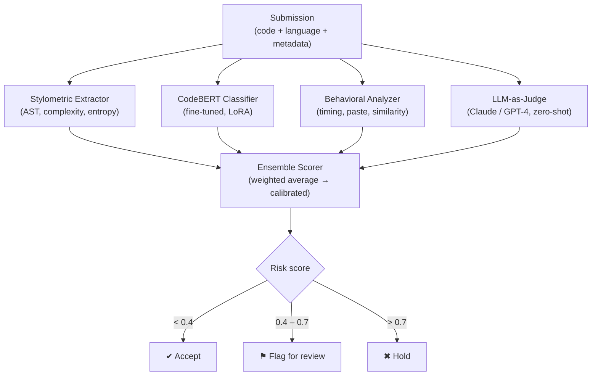

# AI-Generated Code Detector

A multi-approach detection system that identifies AI-generated code in competitive programming submissions. Built on the IBM CodeNet dataset and designed for integration with [epokaprogrammingclub.al](https://epokaprogrammingclub.al).

## Architecture

The detector combines four complementary approaches into an ensemble risk scorer:

1. **Stylometric / Statistical Features** — Perplexity, identifier naming patterns, AST node distributions, comment density, cyclomatic complexity.
2. **Fine-tuned CodeBERT Classifier** — Binary classifier on top of `microsoft/codebert-base`, trained on problem-anchored human vs. AI code pairs.
3. **LLM-as-Judge** — Zero-shot reasoning with GPT-4 / Claude as a second-stage audit on flagged submissions.
4. **Behavioral Signals** — Time-to-submit, paste detection, cross-user similarity (requires platform integration).

The ensemble produces a calibrated risk score (0–1) and a decision: **accept**, **flag for review**, or **hold for admin**.

## Setup

```bash
# Clone
git clone https://github.com/florisitaMali/AI-Generated-Code-Detector.git
cd AI-Generated-Code-Detector

# Create virtual environment
python -m venv .venv
source .venv/bin/activate   # Linux/Mac
.venv\Scripts\activate      # Windows

# Install dependencies
pip install -r requirements.txt

# Configure environment
cp .env.example .env
# Edit .env with your API keys
```

## Dataset Construction

```bash
# 1. Download and filter CodeNet (500 problems, C++/Python/Java)
python scripts/download_codenet.py

# 2. Generate AI solutions
python scripts/generate_ai_solutions.py

# 3. Build labeled dataset with train/val/test splits
python scripts/build_dataset.py
```

**AI-CodeNet (CodeNet-identical tree + CSV):** generates AI solutions into `data/ai_codenet/` (same `data/`, `metadata/`, and per-problem CSV layout as Project_CodeNet) and can merge human + AI into `data/merged_codenet/` for Hugging Face `datasets` or training.

```bash
# Set CODENET_ROOT to your extracted Project_CodeNet (or rely on auto-detection under data/downloads).
# Limit problems: MAX_CODENET_PROBLEMS=10 in .env
python scripts/ai_codenet_pipeline.py
python scripts/merge_codenet_datasets.py
# Optional: add source code + push to Hub
# python scripts/merge_codenet_datasets.py --include-code --accepted-only --push-to-hub your-org/ai-codenet --hf-token $HF_TOKEN
```

## Training

```bash
# Statistical baseline (XGBoost + LightGBM)
python -m src.models.statistical_baseline

# Fine-tune CodeBERT (checkpoints every CODEBERT_SAVE_STEPS under models/codebert/; re-run the same command to resume)
# Optional: CODEBERT_SAVE_STEPS=150 CODEBERT_SAVE_TOTAL_LIMIT=10 CODEBERT_PATIENCE=8
python -m src.models.codebert_classifier
```

## API

```bash
# Start the detection service
uvicorn src.api.main:app --host 0.0.0.0 --port 8000

# Analyze a submission
curl -X POST http://localhost:8000/analyze \
  -H "Content-Type: application/json" \
  -d '{"code": "print(42)", "language": "python"}'
```

## Web UI

Two front-ends are included; both call the same FastAPI backend.

### Streamlit prototype (recommended for the thesis demo)

```bash
# 1. Start the API
uvicorn src.api.main:app --host 127.0.0.1 --port 8000

# 2. In another terminal, launch the Streamlit UI
streamlit run streamlit_app.py
```

Three-panel layout (editor · score · explanation):

- **Editor**: `streamlit-ace` syntax-highlighted editor, language picker, optional `problem_id`.
- **Score**: Plotly risk-gauge (green/amber/red bands at 0.4 / 0.7) + radar chart of the four sub-scores.
- **Explanation**: per-component metrics and the ensemble's human-readable signals (LLM-as-judge reasoning when enabled).

Override the API base with `AI_DETECTOR_API=https://your-host:port streamlit run streamlit_app.py`.

### Lightweight static frontend (served by FastAPI)

The vanilla HTML/CSS/JS UI in `frontend/` is mounted at `/ui` and `/` redirects to it:

- Open `http://127.0.0.1:8000/` after starting `uvicorn`. Paste code, pick the language, click **Analyze** (or `Ctrl/Cmd + Enter`).
- Palette tokens are CSS variables at the top of `frontend/styles.css` (Epoka-inspired navy + red + gold).
- To host the static frontend separately and call a remote API, open the page with `?api=https://your-host:port`.

## Evaluation

All models are evaluated on a held-out test set with precision, recall, F1-score, and AUC-ROC. See [RESULTS.md](RESULTS.md) for thesis-style tables and the dataset figure. Regenerate the overview chart with `python scripts/plot_dataset_summary.py` (writes `docs/figures/dataset_overview.png`). See `notebooks/03_model_comparison.ipynb` for exploratory comparisons.

Focused **XGBoost (stylometric) + LLM-as-judge** evaluation (same `test.parquet`, no CodeBERT/ensemble): run `python scripts/evaluate_xgb_llm_judge.py` and see [PERFORMANCE_EVALUATION.md](PERFORMANCE_EVALUATION.md).

Thesis-oriented write-ups: [IMPLEMENTATION.md](IMPLEMENTATION.md) (software), [EXPERIMENTAL_SETUP.md](EXPERIMENTAL_SETUP.md) (protocol).

## Project Structure

```
config/          Central configuration
scripts/         Dataset construction scripts
src/features/    Stylometric feature extractors
src/models/      ML classifiers (baseline, CodeBERT, LLM-judge)
src/behavioral/  Behavioral signal analyzers
src/ensemble/    Ensemble risk scorer + calibration
src/datasets/    CodeNet / AI-CodeNet schema and path helpers
src/api/         FastAPI service (also serves the web UI)
frontend/        Static single-page UI (HTML/CSS/JS, no build step)
evaluation/      Metrics and evaluation utilities
notebooks/       EDA, analysis, and model comparison
tests/           Unit tests
```

---

## Methodology

Detection is performed by a **four-module ensemble**. Each module independently produces a probability in [0, 1]; a weighted average (weights configurable in `config/settings.py`) produces the final **risk score**.

### Module 1 — Stylometric / Statistical Analysis

Extracts hand-crafted code-style features:

| Feature | Tool |
|---|---|
| AST node-type distribution | `tree-sitter` (multi-language) |
| Cyclomatic complexity, Halstead metrics | `radon` |
| Identifier entropy | Shannon entropy over token vocabulary |
| Comment density | token ratio analysis |
| Token n-gram TF-IDF | `scikit-learn` `TfidfVectorizer` |

These features feed an **XGBoost + LightGBM** ensemble, calibrated with `CalibratedClassifierCV` (isotonic regression) to output proper probabilities. Random Forest's feature-importance output is surfaced in the UI to explain *which* stylometric signals drove the score.

### Module 2 — ML Classifier (CodeBERT)

- **Base model**: `microsoft/codebert-base` (encoder-only, ~125 M parameters).
- **Fine-tuning**: binary classification head (human vs AI), one checkpoint per language.
- **Efficiency**: LoRA adapters (`PEFT`) reduce trainable parameters by ~10×, enabling per-language variants without full GPU memory.
- **Input**: code tokenised to 512 tokens; the `[CLS]` embedding is also extracted as an additional feature for the ensemble.

### Module 3 — LLM-as-Judge (Zero-Shot)

A zero-shot prompt sent to Claude / GPT-4 asking the model to reason about whether the submission shows AI-generation signals:

```
You are an expert code auditor. Here are five human-written solutions to problem X.
Here is a new submission. Does it show signs of AI generation?
Reply in JSON: {"confidence": 0.0-1.0, "flags": [...], "reasoning": "..."}
```

The LLM response is parsed with Pydantic for type safety. This module is invoked as a **second-stage audit** only for submissions with risk ≥ `THRESHOLD_FLAG_REVIEW`, avoiding unnecessary API costs.

### Module 4 — Behavioral / Metadata Signals

Operates on submission metadata — completely immune to code obfuscation:

| Signal | Method |
|---|---|
| Time-to-first-submit | Z-score vs. problem's historical distribution |
| Single-paste detection | `difflib` edit-sequence analysis |
| Cross-user similarity | TF-IDF cosine similarity within a 5-minute window |
| Submission velocity | Consecutive correct submissions in short intervals |

### Ensemble & Decision Thresholds

| Risk score | Decision |
|---|---|
| < 0.4 | **Accept** |
| 0.4 – 0.7 | **Flag for human review** |
| > 0.7 | **Hold** (submission blocked or penalised) |

---

## System Architecture



---

## Dataset

| Property | Detail |
|---|---|
| **Source** | IBM Project CodeNet — 14 M submissions, 4 053 problems, 55 languages |
| **Human label** | Accepted submissions in C, C++, C#, Java, JavaScript, Python filtered by `MIN_ACCEPTED_SOLUTIONS` |
| **AI label** | Generated by GPT-4, Claude, Gemini, CodeLlama, StarCoder via `scripts/ai_codenet_pipeline.py` — one file per (problem × model × language), stored under `data/ai_codenet/` |
| **Schema** | `data/splits/{train,val,test}.parquet` — columns: `problem_id`, `language`, `source`, `label` (0 = human, 1 = AI), `code`, `model_name` |
| **Split** | 70% train / 15% val / 15% test (problem-level stratified split — no leakage) |
| **Expected size** | ~100 k rows (500 problems × 3 AI models × 6 languages × ~10 human solutions) |

---

## Tools & Technologies

| Layer | Technology |
|---|---|
| Language | Python 3.11+ |
| API | FastAPI + Uvicorn |
| UI (prototype) | Streamlit + streamlit-ace + Plotly |
| UI (static) | Vanilla HTML / CSS / JavaScript |
| ML framework | PyTorch + HuggingFace Transformers |
| Pretrained model | `microsoft/codebert-base` |
| Efficient fine-tuning | PEFT / LoRA |
| Gradient boosting | XGBoost, LightGBM (scikit-learn pipeline) |
| Code analysis | tree-sitter (C, C++, C#, Java, JavaScript, Python), radon |
| Data pipeline | pandas, pyarrow (Parquet), HuggingFace `datasets` |
| AI generation | openai, anthropic, google-generativeai |
| LLM judge | Anthropic Claude, OpenAI GPT-4 |
| Visualization | Plotly, Streamlit |

---

## Evaluation Metrics

### Classification performance

| Metric | Description |
|---|---|
| **Precision** | Of submissions flagged as AI, what fraction truly are |
| **Recall** | Of all AI submissions, what fraction are caught |
| **F1-score** | Harmonic mean of precision and recall |
| **AUC-ROC** | Area under the ROC curve across all thresholds |

### Calibration

| Metric | Description |
|---|---|
| **Brier score** | Mean squared error of predicted probabilities vs. true labels (lower is better) |
| **Reliability diagram** | Visual check that predicted probabilities match empirical frequencies |

### Policy simulation

| Metric | Description |
|---|---|
| **False-accept rate** | Human submissions incorrectly held at the 0.7 threshold |
| **False-hold rate** | AI submissions that pass through the 0.4 accept threshold |

Per-language and per-model breakdowns are available in `evaluation/metrics.py` and `notebooks/03_model_comparison.ipynb`.
